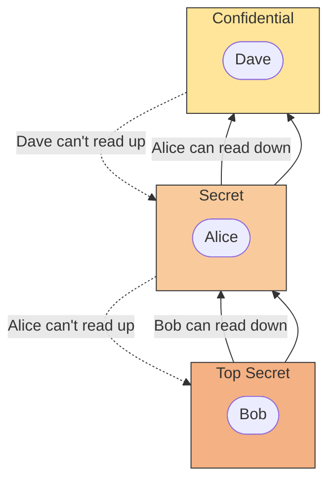
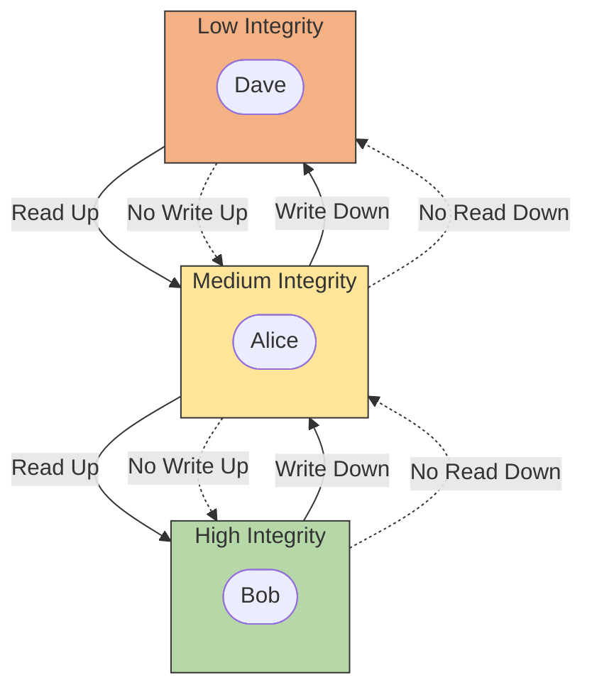

**Tags:** #type/method 

---
# CIA triad
confidentiality: keep data private
integrity: keep data un-altered
availabiltiy: keep data accessible

- all 3 elements have to be satisfied, if not everyhting is useless
**on attack side:**
DAD triad: Disclosure, Alternation and Destruction
# Principles of Privileges
The levels of access given to individuals are determined on two primary factors:

-   The individual's role/function within the organisation
-   The sensitivity of the information being stored on the system
## Privileged Identity Management (PIM)
translate a user's role within an organisation into an access role on a system
## Privileged Access Management(PAM)
management of the privileges a system's access role has, amongst other things
# Organizational Security Models
## Bell-La Padula Model
focuses on confidentiality, eg used by military
    

## Biba Model
focused on keeping integrity

