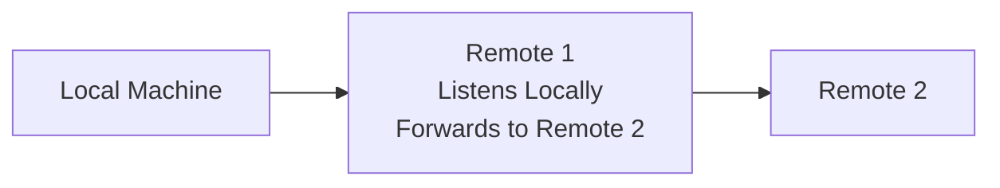
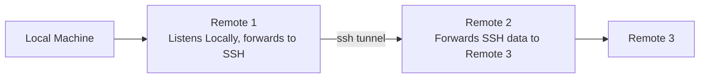

---
tags:
  - "#type/method"
  - "#attack/lateral-movement"
  - "#attack/defense-evasion"
---

---

# Fundamentals

**Port forwarding:** Blindly forward TCP/UDP packets between two ports.

**Proxying:** Proxies can also interpret, manage & analyse connections.

# Pentesting

## Port Forwarding

**Tools:**

- [[3 Tools/shells/Socat|Socat]]: basic port forwarding
- [rinetd](https://github.com/samhocevar/rinetd): runs as daemon --> good for long-term usage
- [[3 Tools/shells/Netcat|Netcat]]: combine with FIFO
- if on Linux & root privileges present: iptables

## SSH Tunneling

**Note:** ssh is preinstalled on modern windows versions and many Linux installs.

There are several types of [[3 Tools/shells/ssh|ssh]] tunneling:

- [[3 Tools/shells/ssh#Local Port Forwarding|Local Port Forwarding]]
	- Packets are tunneled through ssh to a remote host and then (by the remote host) forwarded to a specified destination host&port
	- See diagram below.
- [[3 Tools/shells/ssh#Dynamic Port Forwarding|Dynamic Port Forwarding]]
	- ssh sets up a socks proxy, so packets can be forwarded to multiple destination hosts
- [[3 Tools/shells/ssh#Remote Port Forwarding|Remote Port Forwarding]]
	- connect back from an ssh client to a local ssh server. Set up a listening port on the server & forward the packets to a specified destination host.
- [[3 Tools/shells/ssh#Remote Dynamic Port Forwarding|Remote Dynamic Port Forwarding]]
	- connect back from an ssh client and set up a socks proxy on the ssh server. Tunnels all packets through the ssh connection and forwards them to the destination hosts.
	- **Prerequisite:** SSH client version higher than 7.6 (ssh server version is irrelevant)

Possible scenario, when an ssh server is available & no firewall blocks incoming packets:

**Alternative tool:** [[3 Tools/shells/sshuttle|sshuttle]]

## HTTP Tunneling

Encapsulate data streams in [[2 Tech-Specifics/Network/Protocols/HTTP(S)|HTTP(S)]]

**Tools:**

- [[3 Tools/network/tunneling/Chisel|Chisel]]

## DNS Tunneling

Encapsulate data streams in [[2 Tech-Specifics/Network/Protocols/DNS|DNS]]

**Tools:**

- [[3 Tools/network/tunneling/dnscat2|dnscat2]]

## Metasploit Tunneling

See [[3 Tools/exploitation frameworks/Metasploit/Pivoting with Metasploit|Pivoting with Metasploit]]

## Windows Specifics

- [[3 Tools/shells/Plink|Plink]]: alternative ssh client
- Putty: alternative GUI ssh client
- [[2 Tech-Specifics/OS/Windows/netsh|netsh]]: firewall config tool, requires admin privileges
